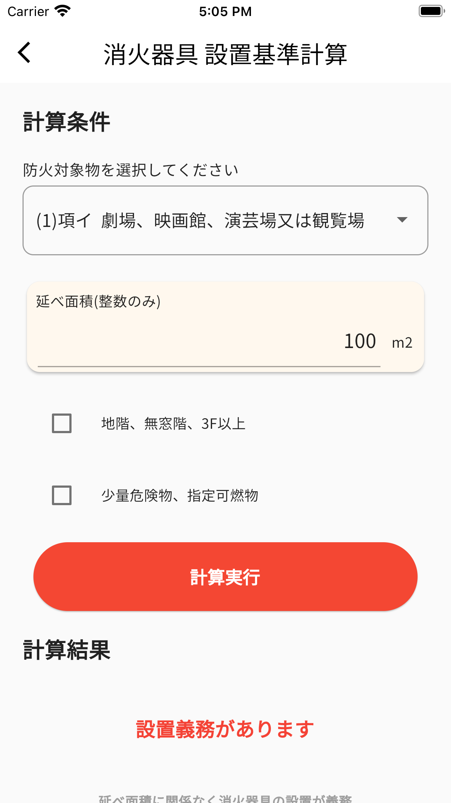

# Firefight equipment calclator (For Japan)

  

## About App

It is a easy calculator for firefight equipment!

This app helps you, when you want to check the installation standards of firefighting equipment, or studying for the firefighting equipment engineer examination.

## Download

Android : under construction

iOS : under construction

[Web App w/ Firebase Hosting](https://firefight-equip-app.web.app)

## Features

- Judgment of obligation to install fire extinguisher, automatic fire alarm, gas leak alarm, earth leakage alarm, and fire reporting equipment
- Calculation of fire extinguisher capacity unit
- Links to firefight law in Japan

## How To Use

[Click here](https://snova301.github.io/AppService/firefight_equip/howtouse.html)

## Store Copylight

- Google Play および Google Play ロゴは、Google LLC の商標です。
- Apple、Apple logo、App Store は米国およびその他の国で登録された Apple Inc.の商標です。
